# Tutorial APAP

## Authors

* **<Sulthan Zahran>** - *<1806191585>* - *<B>*

---
## Tutorial 1
### What I have learned today
### Github
1. Apa itu Issue Tracker? Apa saja masalah yang dapat diselesaikan dengan Issue Tracker?
 Issue tracker adalah sebuah fitur pada github yang dapat digunakan untuk mengatur dan memantau 
 tugas, perbaikan atau bugs yang ada pada project kita. Dengan adanya Issue kita dapat mengatur
 pengerjaan suatu tugas seperti menentukan apa yang dikerjakan, siapa yang mengerjakan/ kepada
 siapa dikerjakan, menentukan label kategorisasi pekerjaan, dan melihat milestone dari issue
 tersebut.
 
2. Apa perbedaan dari git merge dan git merge --squash?
Ketika melakukan git merge, semua history/log commit pada brach yang di-merge akan digabung ke log
commit yang berada di master sementara ketika melakukan git merge -- squash, semua log commit pada
branch akan dijadikan satu ketika di-merge ke branch master namun tidak menghilangkan history/
log commit yang berada di branch.

3. Apa keunggulan menggunakan Version Control System seperti Git dalam pengembangan suatu
aplikasi?
Version control dapat memudahkan kita dalam pengerjaan sebuah aplikasi terlebih lagi jika dikerjakan
dalam sekelompok orang. Dengan version control kita dapat membagi pekerjaan secara mudah. Seorang
programmer bisa mengerjakan bagiannya dalam sebuah aplikasi tanpa terganggu oleh pekerjaan
programmer lainnya. Dengan version control, kita juga dimudahkan dengan pengumpulan pekerjaan dan
pengontrolan pekerjaan tersebut. Kita bisa mengetahui siapa saja yang mengubah sebuah code sehingga
dapat memudahkan pelacakan jika terjadi sebuah error.

### Spring
4. Apa itu library & dependency?
Library adalah sekumpulan code yang digabung/di-bundle menjadi satu dan dapat di import/digunakan
ke code lain. Library memudahkan karena kita tidak perlu lagi bersusah payah membuat fungsi. Kita
dapat mengimport sebuah fungsi dari library asal kita tahu penggunaan dari library tersebut.
Dependency adalah ketergantungan. Dalam dunia programming, suatu program mungkin membutuhkan program
lainnya untuk berjalan. Ada banyak file yang membutuhkan module-module agar file tersebut dapat
berjalan. Module-module tersebut disebut dependencies.

5. Mengapa kita menggunakan Maven? Apakah ada alternatif dari Maven?
Maven adalah salah satu build tools yang menggunakan Project Object Model (POM). Dengan adanya 
build tools ini, kita bisa mengerjakan project di berbagai IDE karena maven dapat membuat struktur
project tersebut sendiri. Maven juga dapat memudahkan kita dalam mengatur dependency. Kita hanya
perlu mendefinisikannya di POM.xml dan maven akan mendownload file dependency tersbut ke repositori
sehingga dapat digunakan. Ada beberapa build tools populer selain maven seperti boot, gradle, 
MsBuild, dan lain-lain

6. Selain untuk pengembangan web, apa saja yang bisa dikembangkan dengan Spring framework?
Spring framework dapat digunakan untuk memudahkan kita dalam membuat program yang minim akan
komponen-komponen yang memiliki ketergantungan satu sama lain. Spring framework juga memudahkan
developer dalam melakukan manajemen transaksi.

7. Apa perbedaan dari @RequestParam dan @PathVariable? Kapan sebaiknya menggunakan
@RequestParam atau @PathVariable?
@RequestParam menerima parameter sebuah method dari query dari sebuah string sementara @PathVariable
menerima parameter untuk method dari URI path. @PathVariable lebih baik digunakan ketika parameter
permintaan bersifat dinamis. Hal ini dilakukan karena @RequestParam melakuan encode dari value
yang diterima, sementara @PathVariable tidak.

### What I did not understand
(tuliskan apa saja yang kurang Anda mengerti, Anda dapat men-_check_ apabila Anda sudah mengerti
dikemudian hari, dan tambahkan tulisan yang membuat Anda mengerti)
- [ ] Kenapa saya harus belajar APAP?
- [x] Kenapa?
 Karena …
(Anda dapat membuat tampilan code dalam README.md menjadi lebih baik. Cari tahu lebih dalam
tentang penulisan README.md di GitHub pada link
[berikut](https://help.github.com/en/articles/basic-writing-and-formatting-syntax))

## Tutorial 2
Pertanyaan 1: Cobalah untuk menambahkan sebuah resep dengan mengakses link berikut:
http://localhost:8080/resep/add?noResep=1&namaDokter=Papa%20APAP&namaPasien=Quanta%20F
asilkom&catatan=Semangat
Apa yang terjadi? Jelaskan mengapa hal tersebut dapat terjadi

Jawab:
Pada halaman localhost:8080 akan muncul error Whitelable Error Page. Hal ini terjadi karena kita
belum membuat template/view tempat kita menampilkan halamannya.

Pertanyaan 2: Menurut kamu anotasi @Autowired pada class Controller tersebut merupakan
implementasi dari konsep apa? Dan jelaskan secara singkat cara kerja @Autowired tersebut dalam
konteks service dan controller yang telah kamu buat

Jawab:
Anotasi @Autowired yang digunakan pada class Controller merupakan implementasi dari konsep dependency
injection. Dengan anotasi ini, kita tidak perlu untuk membuat constructor dan setter pada attribut
class yang menggunakan interface tersebut selama ada bean/class lain yang meng-implement interface
tersebut. Anotasi ini akan meng-inject constructor dan setter dari class lain yang meng-implement
interface tersebut.

Pertanyaan 3: Cobalah untuk menambahkan sebuah resep dengan mengakses link berikut:
http://localhost:8080/resep/add?noResep=1&namaDokter=Papa%20APAP&namaPasien=Quanta%20F
asilkom Apa yang terjadi? Jelaskan mengapa hal tersebut dapat terjadi.

Jawab:
Pada halaman localhost:8080 akan muncul error Whitelable Error Page. Hal ini terjadi karena kita
tidak menambahkan variable "catatan" pada path. Pada fungsi Controller yang memetakan ke halaman 
/resep/add , kita memerlukan 4 variable dari path untuk menampilkan halaman tersebut, yaitu : 
"noResep", "namaDokter", "namaPasien", dan "catatan".

Pertanyaan 4: Jika Papa APAP ingin melihat resep untuk pasien yang bernama Quanta, link apa yang
harus diakses?

Jawab:
Saya tidak bisa menemukan fungsi yang dapat mencari resep berdasarkan nama pada tutorial yang
diberikan kecuali jika diperintahkan untuk membuat fungsi baru. Untuk saat ini, pencarian dengan
nama bisa dilakukan secara manual dengan mengakses link [ini](http://localhost:8080/resep/viewall)

Pertanyaan 5: Tambahkan 1 contoh resep lainnya sesukamu. Lalu cobalah untuk mengakses
http://localhost:8080/resep/viewall , apa yang akan ditampilkan? Sertakan juga bukti screenshotmu.

Jawab:
Page tersebut akan menampilkan semua resep yang telah dibuat dan semua attribut dari resep, yaitu:
noResep, namaDokter, namaPasien, dan catatan.
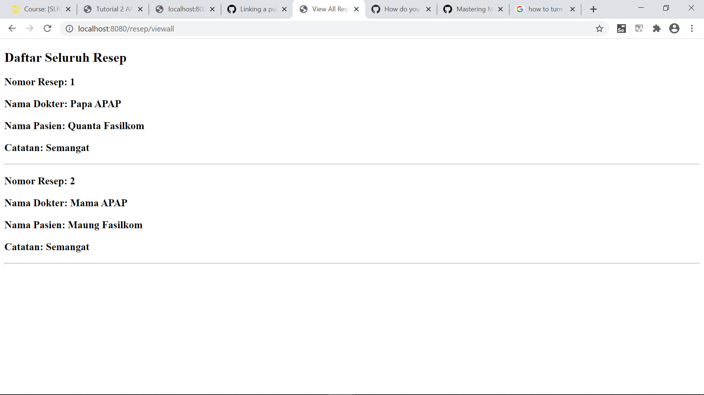

## Tutorial 3
1. Pada class ResepDb, terdapat method findByNoResep, apakah kegunaan dari method tersebut?
Jawab: Method ini berguna untuk mencari data resep dari database yang sudah dibuat. Method ini
menggunakan sebuah parameter yaitu noResep untuk pencarian.

2. Pada class ResepController, jelaskan perbedaan method addResepFormPage dan addResepSubmit?
Jawab: Kedua method memiliki path yang sama namun memiliki kegunaan yang berbeda. Method 
addResepFormPage memiliki tujuan untuk me-render ke halaman yang berisi form. Halaman tersebut
digunakan untuk membuat resep baru. Method addResepSubmit bertujuan untuk merender halaman
yang menunjukkan bahwa resep yang baru ditambahkan berhasil di-submit. Method addResepSubmit
akan dijalankan setelah form pada method addResepFormPage berhasil di-submit.

3. Jelaskan kegunaan dari JPA Repository!
Jawab: JPA(Java Persistence API) berguna untuk melakukan pemetaan class ke tabel-tabel database
tanpa perlu repot mengurusi layer database. Dengan JPA juga, kita dimudahkan dalam melakukan 
pemeliharaan dan manipulasi data di database tersebut.

4. Sebutkan dan jelaskan di bagian kode mana sebuah relasi antara ResepModel dan ObatModel dibuat?
Jawab: ResepModel dan ObatModel berelasi secara one-to-many dari resep ke obat. Hal ini berarti
sebuah resep bisa memiliki banyak obat.

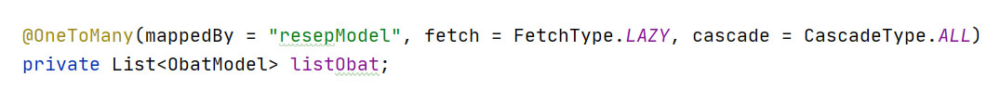

Pada gambar di atas digunakan @OneToMany dari resep ke obat yang terletak pada ListObat

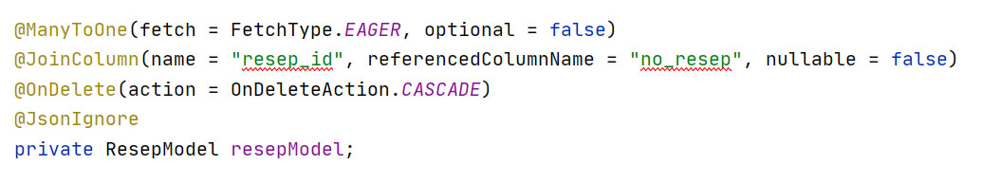
Pada gambar di atas digunakan @ManyToOne dari obat ke resep

5. Jelaskan kegunaan FetchType.LAZY, CascadeType.ALL, dan FetchType.EAGER!
Jawab:

FetchType.LAZY : berguna untuk memerintahkan kepada hibernate agar tidak mengambil object child
saat melakukan fetch terhadap object parent.

FetchType.EAGER : berguna untuk memerintahkan kepada hibernate agar mengambil semua object child
saat melakukan fetch terhadap object parent.

CascadeType.ALL : berguna untuk menerapkan semua operasi yang dikenakan kepada parent ke child-nya
secara otomatis

## Tutorial 4
1. Jelaskan perbedaan th:include dan th:replace!
Jawab:
th:include akan menambahkan konten dari fragment ke dalam host tag-nya tanpa fragment tag-nya, 
sementara th:replace akan mengganti host tag-nya dengan fragment. Penggunaan th:replace akan
menghilangkan host tag dan akan menggantinya dengan fragment beserta fragment tag-nya.

2. Jelaskan apa fungsi dari th:object!
Jawab:
th:object berguna untuk menentukan object yang akan menjadi submit dari sebuah form. th:object
memiliki nilai sebuah nama dari sebuah model.

3. Jelaskan perbedaan dari * dan $ pada saat penggunaan th:object! Kapan harus dipakai?
Jawab:
Pada penggunaan attribut pada th:object, penggunaan $ harus disertai dengan nama model seperti
 "${resep.noResep}", sementara penggunaan * tidak perlu menggunakan nama model selama object 
 sudah ditentukan.

Pada gambar dapat terlihat penggunaan * tanpa perlu menggunakan nama model karena object resep
sudah dipilih sebelumnya. Jika object belum dipilih, maka * juga harus menggunakan nama model
juga sehingga penggunaan * dan $ sama (ekuivalen)

4. Bagaimana kamu menyelesaikan latihan nomor 3?
Jawab:
Pada latihan nomor tiga, pada fragment, saya menambahkan sebuah tag div yang isinya adalah
text. Text tersebut akan berisi sesuai dengan isi dari variable yang bernama "page". Untuk
setiap page yang ingin ditambah text tersebut, saya akan menambah variabel page pada
bagian navbar. Hal ini bertujuan untuk mengirim variable "page" ke fragment.

## Tutorial 5
1. Apa itu Postman? Apa kegunaannya?
Jawab:
Postman adalah sebuah aplikasi yang berguna untuk uji coba REST API. Postman menawarkan
banyak fitur yang membantu dalam pengembangan API seperti:
- Collection
- Environment
- Response
- Mock Server
- dll

2. Jelaskan fungsi dari anotasi @JsonIgnoreProperties dan @JsonProperty.
Jawab:
@JsonIgnoreProperties berguna untuk mengabaikan attribut yang tidak tercantum dalam class
sementara @JsonProperty berguna untuk menandai non-standard setter/getter ketika digunakan
dengan sebuah properti JSON.

3. Apa kegunaan atribut WebClient?
Jawab:
WebClient adalah sebuah interface yang mewakili titik masuk utama untuk melakukan request 
web. WebClient berfungsi sebagai representasi entry point utama pada saat melakukan web
request.

4. Apa itu ResponseEntity dan BindingResult? Apa kegunaannya?
Jawab:
ResponseEntity adalah objek yang merepresentasikan HTTP response. Dengan ResponseEntity kita
dapat mengkonfigurasikan HTTP response secara keseluruhan. BindingResult adalah sebuah objek 
Spring yang menyimpan hasil validasi dan berisi kesalahan yang mungkin terjadi. 
=======
bagian navbar. Hal ini bertujuan untuk mengirim variable "page" ke fragment.

## Tutorial 6
1.Jelaskan secara singkat perbedaan Otentikasi dan Otorisasi! Di bagian mana (dalam kode yang telah anda
buat) konsep tersebut diimplementasi?
Jawab: Otentikasi adalah proses untuk menentukan apakah sebuah user ada/sesuai sementara otorisasi adalah
proses untuk mengidentifikasi apakah sebuah user berhak untuk mengakses suatu seumber daya. Pada file 
WebSecurityConfig.java pada bagian configure.

2. Apa itu BCryptPasswordEncoder? Jelaskan secara singkat cara kerjanya!
Jawab: BCryptPasswordEncoder adalah sebuah objek Spring untuk meng-encode sebuah password. Encode dilakuan
dengan BCrypt hashing function. Cara menggunakannya pertama adalah dengan membuat objek BCryptPasswordEncoder.
Selanjutnya selanjutnya objek digunakan dengan sebuah method yang berparameter password yang ingin di encode.

3. Jelaskan secara singkat apa itu UUID beserta penggunaannya!
Jawab: UUID adalah sebuah angka yang digunakan untuk identifikasi sesuatu secara unik.UUID menggunakan nilai
sebanyak 128-bit. UUID dibuat dengan teknik khusus sehingga unik satu sama lain. UIID sangat cocok digunakan
sebagai primary key sehingga sangat cocok juga digunakan sebagai identifier.

4. Apa kegunaan class UserDetailsServiceImpl.java? Mengapa harus ada class tersebut padahal kita sudah
memiliki class UserServiceImpl.java?
Jawab: UserDetailsServiceImpl adalah sebuah file yang mengimplement file UserDetailsService bawaan Spring
security sehingga tidak sama dengan UserServiceImpl.java yang mengimplement UserService yang dibuat di lokal.
UserDetailsService berfungsi sebagai autentikasi user dengan data yang berada di DB. UserDetailsService akan 
menerjemahkan data dari DB sehingga dapat digunakan oleh bahasa pemrograman yang digunakan sehingga dapat
untuk proses autentikasi.

## Tutorial 7
1. Jelaskan apa yang Anda lakukan di latihan dalam satu paragraf per-soal. Berikan screenshot sebagai ilustrasi
dari apa yang Anda jelaskan.
Jawab: 
Latihan 1:
Saya mengerjakan latihan 1 dengan menambahkan parameter untuk function List yaitu checkbox. parameter checkbox
merupakan boolean. Untuk list yang berada di List Movies, checkbox bernilai false sehingga checkbox mati sedangkan
untuk list My Favorites, checkbox bernilai True sehingga checkboxnya hidup.
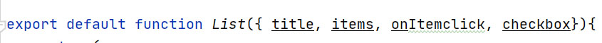
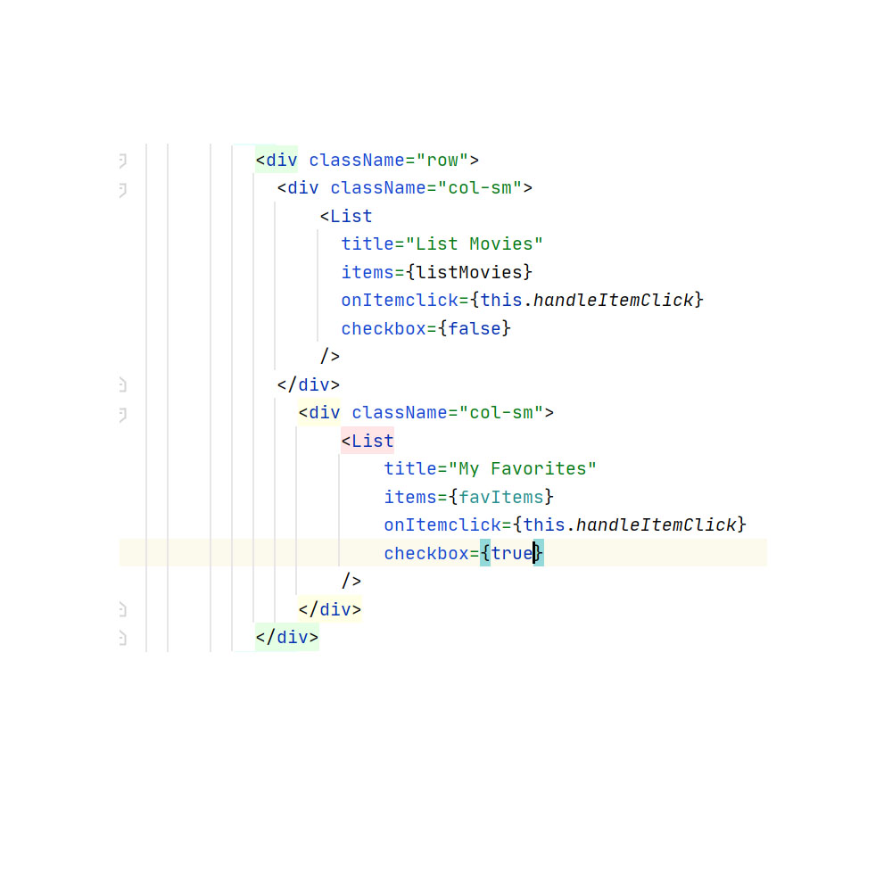

Latihan 2:
Saya mengerjakan latihan 2 dengan membuat function removeAll() dan membuat button hapus yang onClick={this.removeAll}
ke function removeAll()
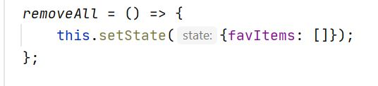
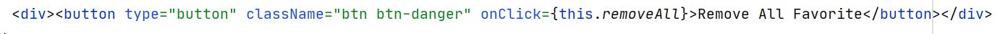

Latihan 3:
Saya mengerjakan latihan 3 dengan memodifikasi function yang sebelumnya handleItemClick menjadi 2 function baru
yaitu handleAddFavorite dan handleRemoveFavorite. handleAddFavorite berfungsi untuk menambah Item sementara
handleRemoveFavorite untuk menghilangkan Item. Pada Item yang berada di List Movies akan dikenakan function
handleAddFavorite dan untuk Item yang berada di  List My Favorites akan dikenakan function handleRemoveFavorite.

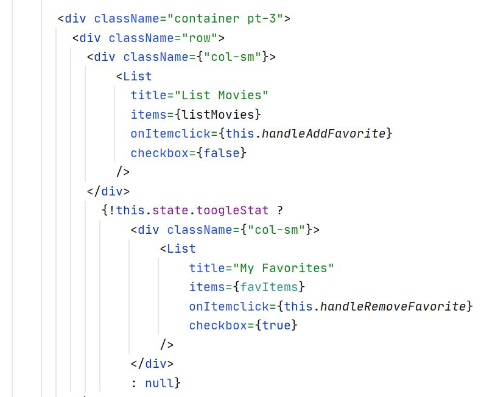

Latihan 4:
Saya mengerjakan latihan 4 dengan menambahkan sebuah state bernama toogleStat yang berupa boolean. Selanjutnya
saya membuat function handleToogle yang berfungsi untuk memberikan nilai boolean berkebalikan dari state. Setelah
itu membuat toogle switch dan menambahkan css untuk style switch tersebut.
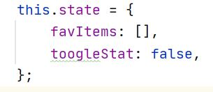
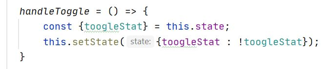

Latihan 5:
Saya mengerjakan latihan 5 dengan membuat component baru bernama EmptyState dan mengecek pada component List.
Apabila list tidak berisis, maka tampilkan component EmptyState
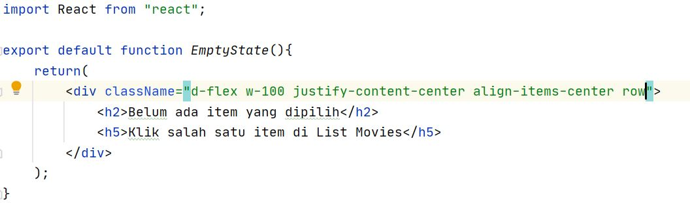
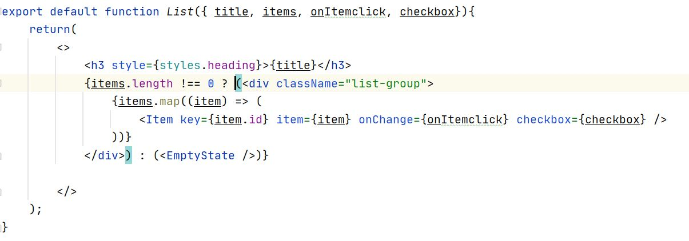

2. Menurut pemahaman kamu selama pengerjaan tutorial ini, apa perbedaan antara state dan props?
Jawab: props adalah data yang nilainya dapat dilemparkan dari satu component ke component lain. Nilai props
biasanya diturunkan dari component parent ke component child-nya. Sedangkan state adalah data private dari
sebuah component. State tidak dapat dilemparkan ke component lain dan tidak dapat diakses oleh component lain.

3. Apa keuntungan menggunakan component (e.g. List, Item) di React? Berikan contohnya!
Jawab: Penggunaan component di React dapat digunakan berulang kali. Dengan hanya membuat component sekali, kita
dapat menggunakan component tersebut berkali-kali. Component di React juga dapat disarangkan/dikombinasikan
dengan component lain. Contoh seperti pada tutorial. Dapat dilihat bahwa component Item dimasukkan ke dalam 
component List sehingga kedua component(Item & List) dapat membentuk suatu hal yang lebih kompleks (List yang
berisi Item).

4. Menurut kamu, apa saja kelebihan menggunakan React dalam pengembangan web?
Jawab:
- Penggunaan component dalam react
- membagi beberapa user interface menjadi beberapa bagian yang independen

5. Menurut kamu, apa saja kekurangan menggunakan React dalam pengembangan web?
Jawab:
- Beberapa versi lawas tidak mendukung/support ReactJS
- ReactJs memiliki dokumentasi yang buruk

